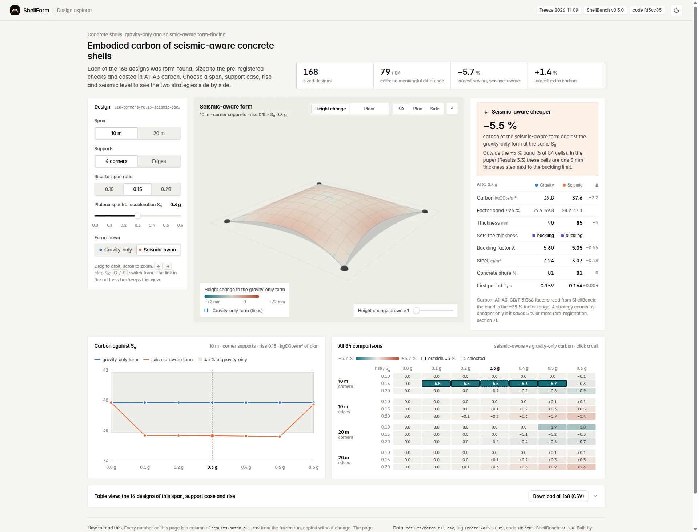
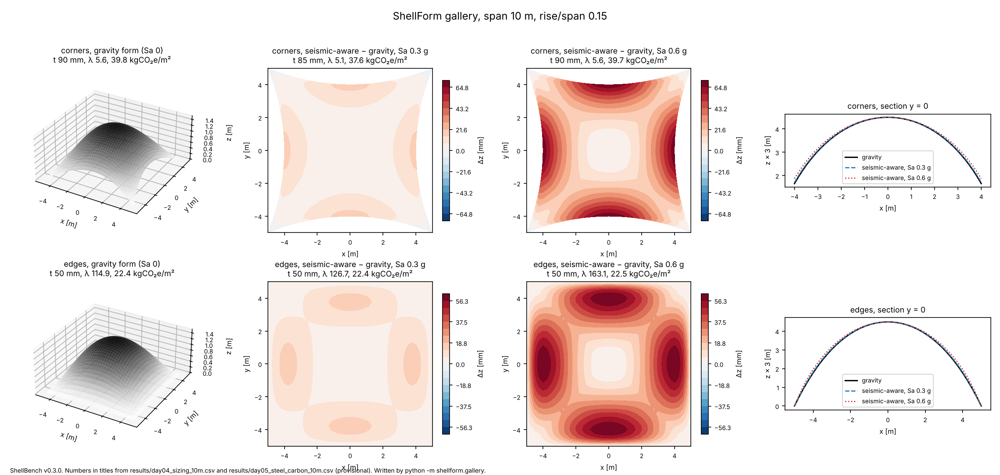
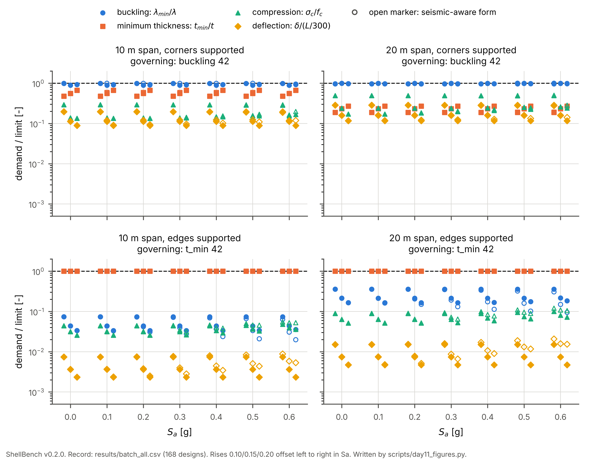
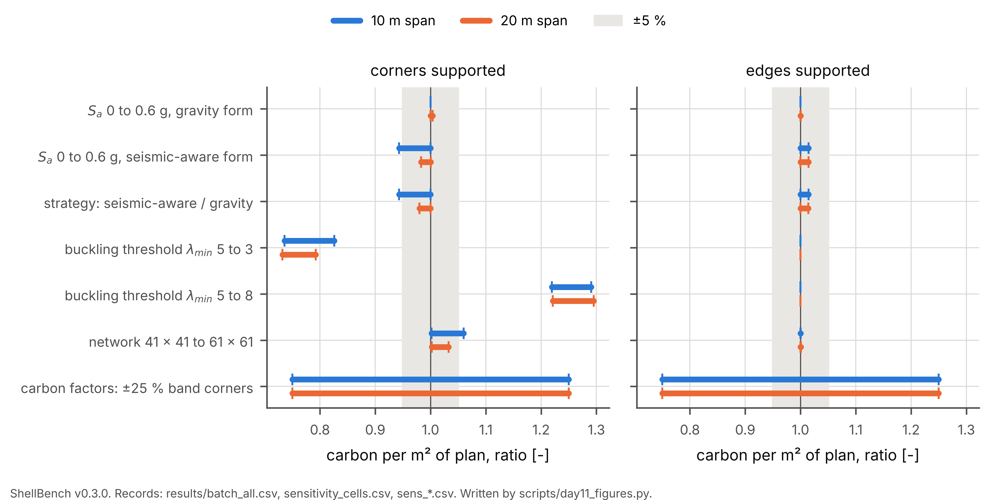
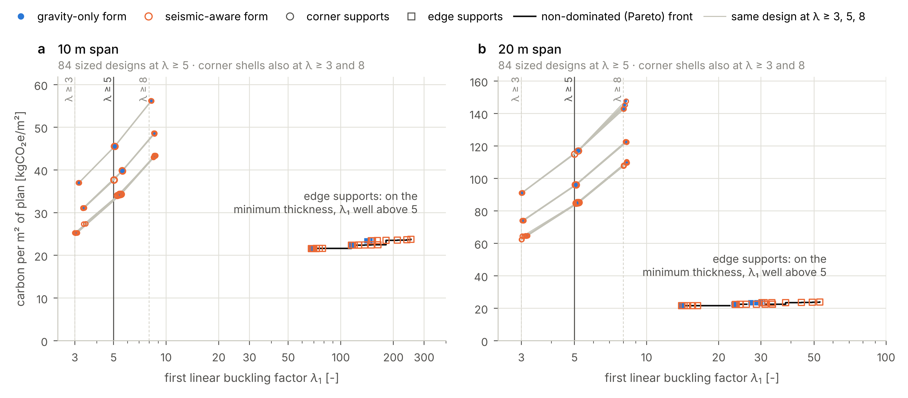

# ShellForm

Gravity-only versus seismic-aware form-finding of reinforced concrete shells: 168 sized designs, their A1-A3 embodied carbon, and an offline explorer.

[](https://github.com/syednafizreja/ShellForm/actions/workflows/tests.yml)
[](https://doi.org/10.5281/zenodo.24084110)

[Explorer](https://syednafizreja.github.io/ShellForm/explorer/) | [Pre-registration](docs/preregistration.md) | [Numbers and sources](paper/numbers.md) | [Reproduce](docs/REPRODUCE.md)

<picture>
  <source media="(prefers-color-scheme: dark)" srcset="docs/img/explorer_dark.webp">
  
</picture>

## The question

How much embodied carbon does seismic resilience cost in a form-found concrete shell, and does form-finding that includes seismic loads deliver it more cheaply than thickening a gravity-only shape?

ShellForm extends the seismic form-finding of Michiels & Adriaenssens (2017, 2018) by sizing each form to pass code checks and counting its A1-A3 embodied carbon. It is built on the validated, tagged modules of [ShellBench](https://github.com/syednafizreja/ShellBench) and never copies a ShellBench value ([data contract](docs/data_contract.md)).

## Result

In 79 of the 84 paired cells the two strategies differ in carbon by less than 5 %, which the pre-registered rule (section 7) counts as no meaningful difference.

The other 5 cells (10 m, corner supports, rise 0.15, Sa 0.1-0.5 g) are one 5 mm thickness step next to the buckling limit, and they disappear under every robustness check. Thickness is set by linear buckling (corner supports) or the 50 mm minimum (edge supports), and steel by the minimum ratio; none of these responds to Sa up to 0.6 g. Every number and its source: [paper/numbers.md](paper/numbers.md).

The record is code tag `freeze-2026-11-09` with ShellBench `v0.3.0`. The archive is on Zenodo, all versions: [10.5281/zenodo.24084110](https://doi.org/10.5281/zenodo.24084110).

## Method

Each shell is form-found as a pin-jointed network in equilibrium (force density method, Schek 1974):

$$
\mathbf{C}_f^{\mathsf T}\mathbf{Q}\,\mathbf{C}_f\,\mathbf{x}_f \;=\; \mathbf{p}_f \;-\; \mathbf{C}_f^{\mathsf T}\mathbf{Q}\,\mathbf{C}_x\,\mathbf{x}_x ,
\qquad
\mathbf{p} = W\,(S_a,\;0,\;-1)
$$

$\mathbf{C}$ is the branch-node matrix (free nodes $f$, supports $x$), $\mathbf{Q}$ the diagonal of force densities, $\mathbf{x}$ the coordinates (solved for $x$, $y$ and $z$ alike) and $\mathbf{p}$ the nodal loads: the weight $W$ of each node, plus a lateral load $S_a W$ (Michiels & Adriaenssens). The seismic-aware form is the midrange of the four thrust surfaces for $S_a$ in $\pm x$ and $\pm y$; the gravity-only form has $S_a = 0$.

Steps:

1. Plan, supports and rise define the network.
2. Force density form-finding gives the gravity-only form (Sa = 0) and the seismic-aware form (midrange of the four thrust surfaces).
3. CalculiX sizes each form: λ1 ≥ 5, compression and L/300.
4. Steel and A1-A3 carbon are counted for each sized design.
5. The 5 % rule is applied to the 84 paired cells.

**Design space.** 2 spans (10, 20 m) × 2 supports (4 corners, continuous edges) × 3 rise-to-span ratios (0.10, 0.15, 0.20) × 2 strategies (gravity-only, seismic-aware) × 7 plateau spectral accelerations (0-0.6 g) = 168 sized designs.

## Figures

All figures are drawn from `results/` by script, at full page width, as 600 dpi PNG and vector PDF ([figures/README.md](figures/README.md); visual system in [docs/visual_style.md](docs/visual_style.md)).



| Fig. 2: what sets the thickness | Fig. 4: what moves carbon |
|---|---|
|  |  |



## Explore

Open the [live explorer](https://syednafizreja.github.io/ShellForm/explorer/), or [`explorer/index.html`](explorer/index.html) straight from disk; it needs no server and no internet (three.js and the Inter typeface are bundled in `explorer/vendor/`). Pick a span, support case, rise and Sa level to see both strategies side by side: the form in 3D coloured by how far the seismic-aware form moves from the gravity-only one, carbon and thickness for each, carbon against Sa, and a clickable matrix of all 84 comparisons. Light and dark themes, keyboard control, a shareable link for every view, and a CSV of all 168 designs.

To try your own plan and supports, [ShellLab](https://syednafizreja.github.io/ShellLab/) runs ShellForm's force-density solver in the browser for any rectangular plan and support layout; its tests check it against ShellForm's own output.

## Verification

Five checks beside the frozen record; no frozen setting or result changed ([notes/day17_verification.md](notes/day17_verification.md), Fig. S1).

| Check | What it shows | Result |
|---|---|---|
| V1 | Complete sphere under pressure, in the same CalculiX path that sizes every shell | Buckles within 2.0 % (R/t 50) and 1.3 % (R/t 100) of the classical value |
| V2 | Mesh convergence | λ1 changes by at most 0.6 % between 61 and 81 nodes per side |
| V3 | Force density equilibrium | Residual below 2.5e-11 N on all 84 form-finding solves |
| V4 | Shell action | 76-100 % of the strain energy is membrane energy |
| V5 | Formwork | No formwork factor or reuse count can move a verdict across the 5 % rule |

The test suite (`tests/`) covers form-finding, sizing, carbon, the paper tables and the visual system, and runs on every push.

## Quick start

You need Python 3.12 and, for the finite element tests and runs, CalculiX (`ccx`) on the path (Ubuntu: `sudo apt install calculix-ccx`). Without `ccx` the tests that call it are skipped. ShellBench is installed from a clone at the tag pinned in [`src/shellform/pin.py`](src/shellform/pin.py).

```bash
git clone --branch v0.3.0 https://github.com/syednafizreja/ShellBench.git ShellBench-pin
git clone https://github.com/syednafizreja/ShellForm.git
cd ShellForm
python -m venv .venv && source .venv/bin/activate   # Windows: .venv\Scripts\activate
pip install -r requirements.txt
pip install -e ../ShellBench-pin --no-deps
pip install -e . --no-deps
python -m pytest                                    # 125 tests, about 1 min
```

Reproduce the study:

```bash
python -m shellform.batch                     # 8 designs (preset smoke8), results/batch_smoke8.csv
python -m shellform.batch --preset all        # all 168 designs
python -m shellform.batch --span 10 --supports corners --sa 0.0 0.6   # any subset
python -m shellform.batch --compare-record    # also check against the committed results
python scripts/day12_freeze.py                # the whole freeze run (about 2 h on 4 workers)
python scripts/day11_figures.py               # paper figures (Figs. 1-5)
python scripts/day17_figures.py               # Fig. 6 and Fig. S1
python scripts/day17_verification.py          # verification checks V1-V5 (about 6 min on 4 workers)
python scripts/day14_paper_tables.py          # paper tables in paper/tables/
python scripts/day18_manuscript_tables.py     # the same tables as LaTeX, paper/tables/latex/
python scripts/day13_explorer_data.py         # explorer/explorer_data.js from results/batch_all.csv
```

Every results row names the ShellBench tag it used.

**Long-term reproduction.** Exact versions are in [`requirements.txt`](requirements.txt) and [`environment-lock.yml`](environment-lock.yml), checksums of every result and figure in [`SHA256SUMS`](SHA256SUMS), and [docs/REPRODUCE.md](docs/REPRODUCE.md) says how to verify the record without running anything and what to do when a dependency no longer installs.

## Repository layout

```text
ShellForm/
├── src/shellform/     form-finding, strategies, sizing, steel, carbon, batch runner, figures
├── scripts/           one script per stage of the study (freeze run, figures, tables, checks)
├── tests/             pytest suite, run in CI on every push
├── results/           the frozen record: every CSV names its ShellBench tag
├── figures/           paper figures, PNG and PDF, with the data behind each
├── explorer/          offline interactive explorer (three.js, no server needed)
├── paper/             paper tables (Markdown, CSV, LaTeX) and the numbers-to-sources map
├── notes/             dated working notes, one per step of the study
├── docs/              pre-registration, data contract, reproduction guide, changelog
├── requirements.txt   pinned Python packages (pip, any platform)
├── environment-lock.yml   exact conda environment of the record (Windows)
└── SHA256SUMS         checksums of every file in results/ and figures/
```

## Pre-registration and record

The study design, the decision rule and the robustness checks were fixed in [docs/preregistration.md](docs/preregistration.md) on 30 Oct 2026, before any design-space run. Every later change is a dated amendment that says why. The history is in [docs/CHANGELOG.md](docs/CHANGELOG.md) and the dated notes in [notes/](notes/README.md). Rules for changes are in [CONTRIBUTING.md](CONTRIBUTING.md).

## Citation

If you use ShellForm, please cite the archived software (the concept DOI always resolves to the latest version):

```bibtex
@software{hasib_shellform,
  author    = {Hasib, Syed Nafiz Reja},
  title     = {{ShellForm}: the carbon cost of seismic resilience in form-found concrete shells},
  publisher = {Zenodo},
  doi       = {10.5281/zenodo.24084110},
  url       = {https://github.com/syednafizreja/ShellForm}
}
```

Machine-readable metadata: [CITATION.cff](CITATION.cff).

## Licence

Code: MIT ([LICENSE](LICENSE)). Bundled third-party files keep their own licences: three.js r128 (MIT, `explorer/vendor/three.LICENSE`) and the Inter typeface (SIL Open Font License 1.1, `assets/fonts/OFL.txt`).
